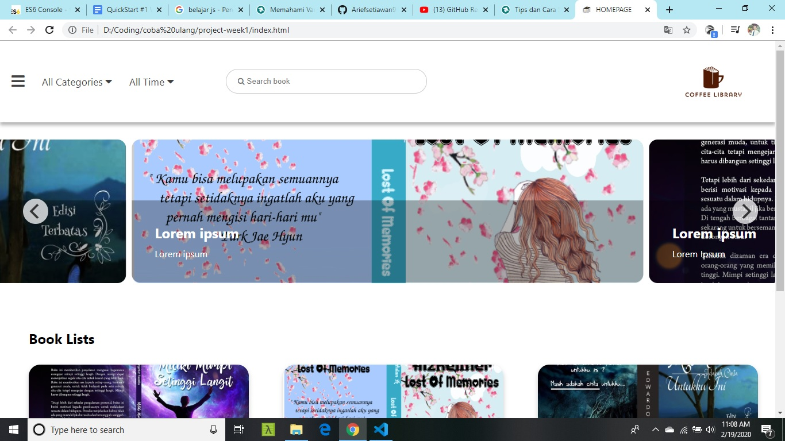
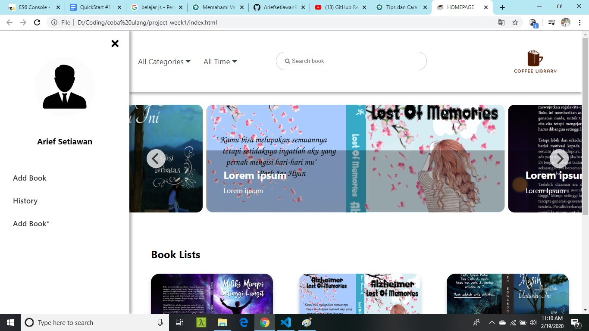
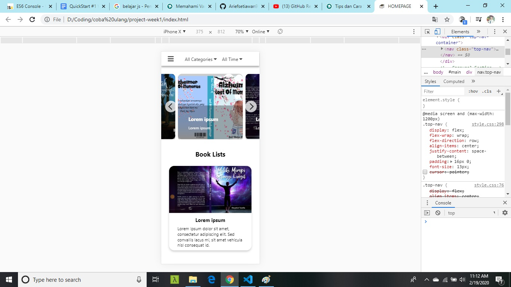
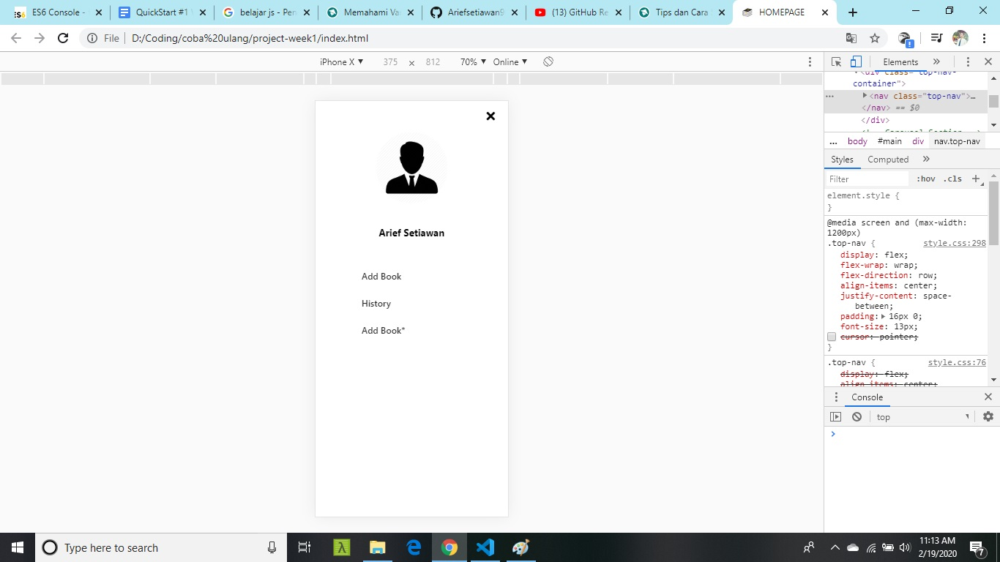

<h1>Project-week1</h1>

By Arief Setiawan (arief.setiawan8788@gmail.com)

Project for Arkademy

<b>Guide</b>
<ol>
  <li>First, create a codes HTML</li>
  <li>second, create style codes CSS, make nav, aside, section</li>
  <li>Then, make responsive with media querirs in the CSS File</li>
  <li>finaly, make interact with js</li>
  
  </ol>
<h3>HOMEPAGE</h3>

<h3>Homepage with sidebar</h3>

<h3>Responsive</h3>

<h3>Responsive with sidebar</h3>

Reference  my project : https://www.figma.com/file/Mj3THivoX0IaTPEZ4vJZoajw/Books?node-id=1%3A3

